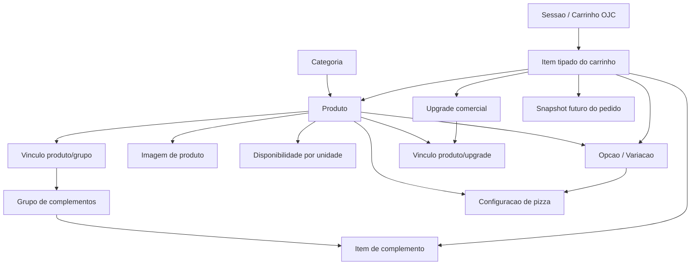

# CATALOG-MODEL-ALVORADA-001

Modelagem tecnica do Catalogo Real da Alvorada

Status: proposta tecnica para homologacao

Escopo: documentacao arquitetural. Nao altera schema, frontend, backend,
Convex, seed, migration, imagens ou dados reais.

Base de referencia:

- CATALOG-FOUNDATION externo
- CATALOG-INSTANCE-ALVORADA-001
- DMI Jornada Cliente Catalogo Digital
- MHO Jornada Cliente Catalogo Digital
- Plano Fase 1 Jornada Cliente Catalogo
- Auditoria tecnica do Catalogo Digital

## 1. Principios

1. O banco de dados sera a fonte da verdade do catalogo operacional.
2. Nao havera hard delete de entidades ja usadas operacionalmente.
3. Toda entidade importada do catalogo real deve ter chave documental estavel.
4. IDs tecnicos do banco sao independentes da chave documental.
5. Catalogo, Carrinho, Pedido, Producao e Venda permanecem separados.
6. Pedido convertido deve guardar snapshots historicos imutaveis.
7. A migracao real deve ser explicita, versionada e idempotente.
8. A modelagem deve ser compativel com IA futura, sem tornar IA decisoria.
9. Nenhuma regra comercial pendente deve ser inventada.
10. A arquitetura deve ser suficiente para o catalogo real, sem overengineering.

Separacao conceitual:

- Estado atual editavel do catalogo: categorias, produtos, opcoes,
  complementos, upgrades, imagens e disponibilidade.
- Eventos operacionais relevantes: interacoes de sessao, ajuda, abandono,
  retomada, conversao e alteracoes sensiveis.
- Snapshots historicos: carrinho convertido e pedido operacional.

O cadastro atual do catalogo nao precisa ser append-only. A exigencia de
imutabilidade recai sobre snapshots de conversao e pedido.

## 2. Identidade, chaves e versao

### 2.1 ID tecnico

O ID tecnico e o identificador nativo do banco, gerado pelo Convex. Ele deve
ser usado para relacionamento interno e performance, mas nao deve ser usado
como chave documental de migracao.

### 2.2 documentKey

Recomendacao:

`CATALOG-ALVORADA:PRODUCT:LAN-001`

Formato conceitual:

`CATALOG-ALVORADA:{ENTITY}:{DOCUMENT_ID}`

Exemplos:

- `CATALOG-ALVORADA:CATEGORY:LAN`
- `CATALOG-ALVORADA:PRODUCT:LAN-001`
- `CATALOG-ALVORADA:OPTION:PIZS-001:TAM-M`
- `CATALOG-ALVORADA:COMPLEMENT:ART-ADICIONAL-BACON`
- `CATALOG-ALVORADA:UPGRADE:BATATA-100G`

Justificativa:

- e estavel;
- e unica;
- suporta migracao idempotente;
- nao depende do nome exibido;
- sobrevive a mudancas comerciais;
- preserva a ligacao com IDs documentais LAN, ART, PIZS, PIZD, POR, CAL,
  SUC, BEB e CER.

### 2.3 Slug

Slug e opcional e deve servir apenas para URL, busca ou exibicao tecnica. Nao
deve ser chave de migracao.

### 2.4 Versao

Cada entidade importada deve registrar:

- `catalogInstance`: exemplo `CATALOG-INSTANCE-ALVORADA-001`;
- `documentVersion`: versao documental aplicada;
- `schemaContractVersion`: versao do contrato tecnico;
- `migrationStatus`: estado da aplicacao da modelagem/migracao.

Estados conceituais de migracao:

- `dry_run`;
- `pronto_para_aplicar`;
- `aplicado`;
- `aplicado_com_pendencias`;
- `rollback_necessario`.

## 3. Categoria

Finalidade: organizar o catalogo em grupos navegaveis.

Campos:

| Campo | Tipo conceitual | Obrigatorio | Observacao |
| --- | --- | --- | --- |
| idTecnico | Id banco | Sim | Gerado pelo banco |
| documentKey | Texto unico | Sim | Ex.: `CATALOG-ALVORADA:CATEGORY:LAN` |
| documentId | Texto curto | Sim | Ex.: `LAN`, `PIZS`, `CER` |
| nome | Texto | Sim | Nome exibido |
| slug | Texto | Opcional | URL/busca |
| icone | Texto | Opcional | Icone visual |
| ordem | Numero | Sim | Ordenacao |
| ativa | Booleano | Sim | Disponibilidade geral |
| catalogInstance | Texto | Sim | Instancia documental |
| migrationStatus | Enum | Opcional | Controle de migracao |
| createdAt/updatedAt | Data | Sim | Auditoria |
| createdBy/updatedBy | Usuario | Opcional | Auditoria futura |

Estados: ativa, inativa, pendente_validacao.

Relacionamentos:

- categoria possui produtos;
- categoria pode escopar grupos de complementos;
- categoria pode ter disponibilidade por unidade.

Indices recomendados:

- `by_document_key`;
- `by_document_id`;
- `by_slug`;
- `by_order`;
- `by_active`.

Ativacao/inativacao:

- categoria inativa nao deve aparecer para o cliente;
- produtos podem permanecer preservados para historico.

Exclusao:

- nao fazer hard delete quando houver produtos, carrinhos ou pedidos
  relacionados.

Exemplo Alvorada:

- documentId: `LAN`
- nome: `Lanches`
- documentKey: `CATALOG-ALVORADA:CATEGORY:LAN`

## 4. Produto

Finalidade: representar o item comercial principal do catalogo, sem duplicar
por tamanho, volume, sabor ou complemento.

Campos:

| Campo | Tipo conceitual | Obrigatorio | Observacao |
| --- | --- | --- | --- |
| idTecnico | Id banco | Sim | Gerado pelo banco |
| documentKey | Texto unico | Sim | Ex.: `CATALOG-ALVORADA:PRODUCT:LAN-001` |
| documentId | Texto curto | Sim | Ex.: `LAN-001` |
| categoriaId | Id categoria | Sim | Relacao tecnica |
| categoriaDocumentKey | Texto | Sim | Snapshot documental |
| subcategoria | Texto/classificador | Opcional | Evita tabela extra neste momento |
| familia | Texto/classificador | Opcional | Evita tabela extra neste momento |
| nome | Texto | Sim | Nome exibido |
| descricaoCurta | Texto | Opcional | Objetiva, sem texto promocional |
| origem | Enum | Sim | Produzido, Revendido, Misto, ou pendente |
| ativo | Booleano | Sim | Disponibilidade geral |
| ordem | Numero | Opcional | Ordenacao |
| destaque | Booleano | Opcional | Destaques do catalogo |
| unidadeReferencia | Texto | Opcional | Ex.: ml, g, unidade |
| setorProducaoFuturo | Texto | Opcional | Preparado para Producao, sem ativar modulo |
| possuiOpcoes | Booleano | Sim | Indica variacoes/opcoes |
| precoBase | Dinheiro | Opcional | Apenas quando produto puder ter preco direto |
| statusPreco | Enum | Opcional | confirmado, pendente, aguardando_confirmacao |
| catalogInstance | Texto | Sim | Instancia documental |
| documentVersion | Texto | Sim | Versao documental |
| migrationStatus | Enum | Opcional | Controle da migracao |
| createdAt/updatedAt | Data | Sim | Auditoria |
| createdBy/updatedBy | Usuario | Opcional | Auditoria futura |

Estados:

- ativo;
- inativo;
- pendente_validacao;
- indisponivel_temporariamente.

Relacionamentos:

- pertence a uma categoria;
- pode possuir opcoes/variacoes;
- pode se vincular a grupos de complementos;
- pode se vincular a upgrades comerciais;
- pode possuir imagens;
- pode possuir disponibilidade por unidade.

Indices recomendados:

- `by_document_key`;
- `by_document_id`;
- `by_category`;
- `by_active`;
- `by_origin`;
- `by_category_order`;
- `by_migration_status`.

Ativacao/inativacao:

- produto sem preco obrigatorio confirmado pode ficar inativo ou pendente;
- produto inativo nao aparece para venda ao cliente;
- pedidos historicos continuam preservados por snapshot.

Exclusao:

- nao fazer hard delete se houver carrinho, pedido, item de pedido ou evento
  relacionado.

Exemplo Alvorada:

- documentId: `LAN-001`
- nome: `X-Tudo Prime`
- categoria: `Lanches`
- subcategoria: `Tradicionais`
- familia: `X`
- origem: `Produzido`
- descricaoCurta: `2 hamburgueres, bacon, calabresa, catupiry, presunto e salada.`

## 5. Subcategoria e familia

Recomendacao: manter `subcategoria` e `familia` como classificadores opcionais
no produto nesta fase.

Alternativa rejeitada: criar tabelas proprias para subcategorias e familias.

Justificativa:

- o catalogo real precisa organizar melhor os produtos;
- ainda nao ha fluxo operacional proprio para subcategoria/familia;
- criar tabelas agora aumentaria complexidade sem ganho imediato;
- campos opcionais preservam simplicidade e permitem evolucao futura.

Exemplo:

| Categoria | Subcategoria | Familia | Produto |
| --- | --- | --- | --- |
| Pizzas Salgadas | Frango | Frango | Frango com Catupiry |
| Sucos | Naturais | Acerola | Suco de Acerola |
| Lanches | Tradicionais | X | X-Tudo Prime |

## 6. Opcao ou variacao de produto

Finalidade: representar escolhas vendaveis associadas ao produto, sem duplicar
o produto.

Campos:

| Campo | Tipo conceitual | Obrigatorio | Observacao |
| --- | --- | --- | --- |
| idTecnico | Id banco | Sim | Gerado pelo banco |
| documentKey | Texto unico | Sim | Ex.: `CATALOG-ALVORADA:OPTION:SUC-001:COPO-AGUA` |
| produtoId | Id produto | Sim | Relacao tecnica |
| produtoDocumentKey | Texto | Sim | Relacao documental |
| tipo | Enum/texto | Sim | tamanho, volume, recipiente_base, embalagem |
| codigo | Texto | Sim | Ex.: `P`, `M`, `G`, `COPO_AGUA` |
| nomeExibido | Texto | Sim | Ex.: `Copo com agua` |
| preco | Dinheiro | Opcional | Pode ser pendente |
| statusPreco | Enum | Sim | confirmado, pendente, aguardando_confirmacao |
| ordem | Numero | Sim | Ordenacao |
| ativa | Booleano | Sim | Disponibilidade |
| obrigatoria | Booleano | Sim | Produto exige selecao? |
| dimensoes | Objeto conceitual | Opcional | Ex.: recipiente=copo, base=agua |
| compatibilidade | Objeto conceitual | Opcional | Regras simples |
| catalogInstance | Texto | Sim | Instancia documental |
| createdAt/updatedAt | Data | Sim | Auditoria |

Indices recomendados:

- `by_document_key`;
- `by_product`;
- `by_product_order`;
- `by_status_price`;
- `by_active`.

Modelo recomendado para sucos: **opcao combinada**.

Exemplo:

- `Copo com agua`
- `Copo com leite`
- `Jarra com agua`
- `Jarra com leite`

Alternativa rejeitada para esta fase: dimensoes independentes obrigatorias
`recipiente` + `base`.

Justificativa:

- preco fica direto na opcao;
- ProductSheet fica mais simples;
- carrinho e snapshot ficam menos ambiguos;
- migracao dos 94 valores fica auditavel;
- gestao futura entende cada opcao como linha comercial clara.

O campo `dimensoes` pode registrar a semantica internamente sem exigir um
motor multidimensional agora.

Exemplos Alvorada:

- Suco de Acerola: `Copo com agua`, `Copo com leite`, `Jarra com agua`,
  `Jarra com leite`.
- Caldo: `300 ml`, `500 ml`.
- Pizza Calabresa: `P`, `M`, `G`.
- Coca-Cola: `600 ml`, `1 litro`, conforme confirmacao.

## 7. Grupo de complementos

Finalidade: agrupar adicionais ou acompanhamentos selecionaveis.

Campos:

| Campo | Tipo conceitual | Obrigatorio | Observacao |
| --- | --- | --- | --- |
| idTecnico | Id banco | Sim | Gerado pelo banco |
| documentKey | Texto unico | Sim | Ex.: `CATALOG-ALVORADA:COMPLEMENT-GROUP:ART-ADICIONAIS` |
| nome | Texto | Sim | Ex.: `Adicionais dos Artesanais` |
| descricao | Texto | Opcional | Uso interno |
| minimo | Numero | Sim | Normalmente 0 |
| maximo | Numero | Opcional | Limite de selecao |
| obrigatorio | Booleano | Sim | Se cliente precisa escolher |
| ativo | Booleano | Sim | Disponibilidade |
| ordem | Numero | Sim | Ordenacao |
| escopoPadrao | Enum | Opcional | produto, categoria, familia |
| catalogInstance | Texto | Sim | Instancia documental |
| createdAt/updatedAt | Data | Sim | Auditoria |

Indices recomendados:

- `by_document_key`;
- `by_active`;
- `by_order`.

Exemplo Alvorada:

- nome: `Adicionais dos Artesanais`
- minimo: `0`
- obrigatorio: `false`

## 8. Item de complemento

Finalidade: representar cada adicional selecionavel dentro de um grupo.

Campos:

| Campo | Tipo conceitual | Obrigatorio | Observacao |
| --- | --- | --- | --- |
| idTecnico | Id banco | Sim | Gerado pelo banco |
| documentKey | Texto unico | Sim | Ex.: `CATALOG-ALVORADA:COMPLEMENT:ART-BACON` |
| grupoId | Id grupo | Sim | Relacao tecnica |
| nome | Texto | Sim | Ex.: `Bacon` |
| preco | Dinheiro | Opcional | Pode ser pendente |
| statusPreco | Enum | Sim | confirmado, pendente, aguardando_confirmacao |
| quantidadeMaxima | Numero | Opcional | Limite por item |
| ativo | Booleano | Sim | Disponibilidade |
| ordem | Numero | Sim | Ordenacao |
| conteudoPendente | Booleano | Opcional | Para `Outros adicionais` |
| observacaoDocumental | Texto | Opcional | Pendencia sem inferir |
| createdAt/updatedAt | Data | Sim | Auditoria |

Exemplo Alvorada:

- Hambúrguer: 6,00
- Muçarela: 6,00
- Bacon: 6,00
- Outros adicionais: 3,50, conteudo pendente

Regra: nao inventar os itens internos de `Outros adicionais`.

## 9. Vinculo produto/grupo de complementos

Finalidade: controlar em quais produtos, categorias ou familias um grupo pode
ser usado.

Campos:

| Campo | Tipo conceitual | Obrigatorio | Observacao |
| --- | --- | --- | --- |
| idTecnico | Id banco | Sim | Gerado pelo banco |
| documentKey | Texto unico | Sim | Chave do vinculo |
| grupoId | Id grupo | Sim | Grupo aplicado |
| produtoId | Id produto | Opcional | Escopo direto |
| categoriaId | Id categoria | Opcional | Escopo amplo |
| familia | Texto | Opcional | Escopo leve |
| subcategoria | Texto | Opcional | Escopo leve |
| ativo | Booleano | Sim | Disponibilidade |
| prioridade | Numero | Opcional | Resolve sobreposicao |
| createdAt/updatedAt | Data | Sim | Auditoria |

Regra:

- pelo menos um escopo deve estar definido;
- vinculo especifico de produto prevalece sobre categoria/familia.

Exemplo:

- Grupo `Adicionais dos Artesanais` vinculado a categoria `Artesanais`.

## 10. Upgrade comercial

Finalidade: registrar oferta comercial distinta de variacao, complemento,
adicional, desconto, promocao ou combo.

Campos:

| Campo | Tipo conceitual | Obrigatorio | Observacao |
| --- | --- | --- | --- |
| idTecnico | Id banco | Sim | Gerado pelo banco |
| documentKey | Texto unico | Sim | Ex.: `CATALOG-ALVORADA:UPGRADE:BATATA-100G` |
| nome | Texto | Sim | `+100 g de batata` |
| descricao | Texto | Opcional | Sem decidir UX final |
| statusModelagem | Enum | Sim | `PENDENTE_DE_MODELAGEM_OPERACIONAL` |
| preco | Dinheiro | Opcional | Se confirmado futuramente |
| statusPreco | Enum | Opcional | confirmado, pendente |
| ativo | Booleano | Sim | Pode iniciar inativo |
| semanticaFinal | Enum | Opcional | upsell, combo, adicional, troca_composicao, outra |
| createdAt/updatedAt | Data | Sim | Auditoria |

Exemplo Alvorada:

- `+100 g de batata`
- ocorrencias: Burguer Simples; Caribe
- status: `PENDENTE_DE_MODELAGEM_OPERACIONAL`

Regra:

- nao hardcodear no frontend;
- nao classificar como variacao simples nesta etapa;
- pode compartilhar infraestrutura futura, mas preservando semantica.

## 11. Vinculo produto/upgrade

Finalidade: declarar onde o upgrade comercial pode aparecer.

Campos:

| Campo | Tipo conceitual | Obrigatorio | Observacao |
| --- | --- | --- | --- |
| idTecnico | Id banco | Sim | Gerado pelo banco |
| documentKey | Texto unico | Sim | Chave do vinculo |
| upgradeId | Id upgrade | Sim | Upgrade aplicado |
| produtoId | Id produto | Sim | Produto elegivel |
| ativo | Booleano | Sim | Disponibilidade |
| statusOperacional | Enum | Sim | pendente, aprovado, suspenso |
| createdAt/updatedAt | Data | Sim | Auditoria |

Exemplos:

- Burguer Simples -> `+100 g de batata`
- Caribe -> `+100 g de batata`

## 12. Imagem de produto

Finalidade: representar imagem de produto sem tornar a existencia da foto
condicao para exibir o produto.

Campos:

| Campo | Tipo conceitual | Obrigatorio | Observacao |
| --- | --- | --- | --- |
| idTecnico | Id banco | Sim | Gerado pelo banco |
| documentKey | Texto unico | Sim | Chave da imagem |
| produtoId | Id produto | Sim | Produto relacionado |
| referenciaInterna | Texto | Opcional | Caminho/asset controlado |
| urlControlada | Texto | Opcional | Somente fonte controlada |
| origemImagem | Enum | Sim | Propria, Oficial fabricante, Generica, Placeholder |
| statusImagem | Enum | Sim | Aprovada, Provisoria, Substituir |
| textoAlternativo | Texto | Sim | Acessibilidade |
| pendenciaSubstituicao | Texto | Opcional | Motivo da troca futura |
| principal | Booleano | Sim | Imagem principal |
| ordem | Numero | Opcional | Galeria futura |
| ativa | Booleano | Sim | Disponibilidade |
| atualizadoEm | Data | Sim | Auditoria |
| atualizadoPor | Usuario | Opcional | Auditoria futura |

Indices recomendados:

- `by_product`;
- `by_product_main`;
- `by_status`;
- `by_origin`.

Politica homologada:

- nenhum produto sera ocultado por falta de imagem;
- 52 produzidos podem iniciar com imagem generica provisoria;
- 7 revendidos comecam em placeholder;
- revendidos devem futuramente receber imagem oficial correta;
- imagem propria da Alvorada tem prioridade;
- placeholder e ultimo fallback;
- trocar imagem nao cria produto e nao altera preco ou variacoes.

Recomendacao de assets:

- imagens proprias e genericas aprovadas devem viver em armazenamento
  controlado pelo sistema;
- imagens oficiais de fabricante devem ter referencia autorizada e correta de
  embalagem/volume;
- evitar URLs externas instaveis como estrategia principal.

## 13. Disponibilidade por unidade

Finalidade: permitir variacao operacional por unidade sem duplicar produto.

Campos:

| Campo | Tipo conceitual | Obrigatorio | Observacao |
| --- | --- | --- | --- |
| idTecnico | Id banco | Sim | Gerado pelo banco |
| documentKey | Texto unico | Sim | Chave do vinculo |
| unit | Texto | Sim | Unidade operacional |
| produtoId | Id produto | Opcional | Produto disponivel |
| opcaoId | Id opcao | Opcional | Opcao disponivel |
| complementoId | Id complemento | Opcional | Complemento disponivel |
| disponivel | Booleano | Sim | Disponibilidade |
| ativo | Booleano | Sim | Registro ativo |
| precoEspecifico | Dinheiro | Opcional | Futuro, se aprovado |
| indisponivelAte | Data | Opcional | Indisponibilidade temporaria |
| motivo | Texto | Opcional | Auditoria operacional |
| updatedAt/updatedBy | Auditoria | Sim/Opcional | Auditoria futura |

Estrutura minima recomendada agora:

- suportar disponibilidade por produto e opcao;
- deixar preco especifico por unidade como opcional futuro;
- disponibilidade real por unidade segue pendente de decisao da Alvorada.

## 14. Configuracao de pizza

Finalidade: permitir pizza como um item configurado no carrinho/pedido, sem
apagar a identidade documental propria de cada sabor.

Regras homologadas:

- cada sabor de pizza e um Produto do catalogo;
- cada sabor possui documentKey, descricao, imagem/fallback, precos P/M/G,
  ativacao, disponibilidade e promocao individual futura;
- pizza de dois sabores vira um unico item no carrinho/pedido;
- o primeiro sabor referencia um Produto;
- o segundo sabor opcional referencia outro Produto compativel;
- tamanho P aceita um sabor;
- tamanho M aceita um ou dois sabores;
- tamanho G aceita um ou dois sabores;
- segundo sabor nao transforma a pizza em dois itens;
- sabores ficam no mesmo item;
- pizzas doces e salgadas usam a mesma base estrutural;
- politica financeira de dois sabores permanece pendente.

Campos conceituais:

| Campo | Tipo conceitual | Obrigatorio | Observacao |
| --- | --- | --- | --- |
| produtoId | Id produto | Sim | Pizza base/sabor principal |
| tipoPizza | Enum | Sim | salgada, doce |
| tamanhosPermitidos | Lista | Sim | P, M, G |
| limiteSaboresPorTamanho | Objeto | Sim | P=1, M=2, G=2 |
| politicaPrecoDoisSabores | Enum | Sim | `PENDENTE_DE_VALIDACAO` |
| permiteSegundoSabor | Booleano por tamanho | Sim | Derivado do limite |
| composicaoSabor | Texto/lista | Opcional | Ingredientes do sabor |
| apresentacaoProducao | Objeto | Sim | Tamanho + sabor principal + segundo sabor |

Enum conceitual futura para politica de preco:

- `PENDENTE_DE_VALIDACAO`;
- `MAIOR_PRECO`;
- `MEDIA`;
- `SOMA_PROPORCIONAL`;
- `ACRESCIMO_FIXO`;
- `OUTRA`.

Valor atual obrigatorio:

- `PENDENTE_DE_VALIDACAO`.

Como impedir segundo sabor no tamanho P:

- a selecao do segundo sabor deve consultar `limiteSaboresPorTamanho`;
- se tamanho = P, o limite e 1;
- o ProductSheet nao deve oferecer segundo sabor;
- o carrinho deve rejeitar snapshot com segundo sabor em P;
- a futura mutation tambem deve validar antes de persistir.

Snapshot de pizza:

- produto/sabor principal;
- documentKey do sabor principal;
- tamanho;
- segundo sabor opcional;
- documentKey do segundo sabor, quando houver;
- politica de preco usada;
- status da politica se pendente;
- preco calculado somente quando regra estiver validada.

Exemplo conceitual Alvorada:

- sabor principal: Pizza Frango com Catupiry;
- documentKey principal: `CATALOG-ALVORADA:PRODUCT:PIZS-001`;
- tamanho: G;
- segundo sabor: Pizza Calabresa;
- documentKey segundo sabor: `CATALOG-ALVORADA:PRODUCT:PIZS-002`;
- carrinho: um unico item de pizza;
- politica financeira: `PENDENTE_DE_VALIDACAO`;
- snapshot do pedido: preserva os dois sabores, o tamanho G, os dois
  documentKeys, descricoes, precos conhecidos, status da politica financeira
  e composicao apresentada a Producao.

## 15. Sessao/carrinho OJC tipado

Estado atual: `sessoesCatalogo.itensSnapshot` guarda string JSON.

Proposta: contrato tipado de carrinho na sessao OJC, separado de pedido.

Contrato conceitual:

| Campo | Tipo conceitual | Obrigatorio | Observacao |
| --- | --- | --- | --- |
| contractVersion | Texto | Sim | Ex.: `catalog-cart-v1` |
| sessionId | Id sessao | Sim | Sessao OJC |
| unit | Texto | Sim | Unidade |
| customerSnapshot | Objeto | Opcional | Cliente identificado ou anonimo |
| items | Lista | Sim | Itens do carrinho |
| quantidadeItens | Numero | Sim | Total de unidades |
| valorEstimado | Dinheiro | Opcional | Nao e pedido |
| status | Enum | Sim | navegando, carrinho, aguardando, assumida etc. |
| updatedAt | Data | Sim | Ultima alteracao |

Item do carrinho:

| Campo | Tipo conceitual | Obrigatorio | Observacao |
| --- | --- | --- | --- |
| cartItemId | Texto | Sim | ID interno do item no carrinho |
| productId | Id produto | Sim | Produto atual |
| productDocumentKey | Texto | Sim | Chave estavel |
| nomeSnapshot | Texto | Sim | Nome no momento |
| origemSnapshot | Enum | Sim | Produzido, Revendido, Misto |
| quantidade | Numero | Sim | Quantidade |
| selectedOption | Objeto | Opcional | Opcao/variacao selecionada |
| pizzaSelection | Objeto | Opcional | Tamanho/sabores |
| complements | Lista | Opcional | Adicionais escolhidos |
| upgrades | Lista | Opcional | Upgrades comerciais |
| observacao | Texto | Opcional | Observacao do cliente/atendente |
| precoUnitario | Dinheiro | Opcional | Conforme preco confirmado |
| componentesPreco | Lista | Opcional | Produto, opcao, adicional, upgrade |
| totalItem | Dinheiro | Opcional | Soma do item |
| imageSnapshot | Objeto | Opcional | Apenas apresentacao |

Separacao obrigatoria:

- carrinho pode mudar;
- evento operacional registra alteracoes relevantes quando necessario;
- snapshot de conversao para pedido e imutavel.

Nao implementar pedido nesta etapa.

## 16. Snapshot futuro do pedido

Finalidade: garantir que o pedido historico nao dependa do catalogo atual.

Campos a copiar na conversao OJC/ROR:

- productId tecnico;
- productDocumentKey;
- nome do produto;
- descricao curta relevante;
- categoria;
- subcategoria;
- familia;
- origem;
- setor futuro;
- quantidade;
- opcao/variacao selecionada;
- sabores de pizza;
- politica de preco aplicada;
- complementos;
- upgrade comercial;
- observacao;
- preco unitario;
- componentes do preco;
- subtotal;
- imagem snapshot apenas visual;
- catalogInstance;
- documentVersion;
- contractVersion;
- timestamp da conversao.

Regra:

- alteracoes futuras no catalogo nao reescrevem pedido historico;
- pedido nao recalcula item antigo a partir do produto atual.

## 17. Seed, fallback e dados demo

Estado atual identificado:

- 5 categorias demo no seed;
- 19 produtos demo no seed;
- 9 produtos fallback local no frontend;
- seed automatico pode ocorrer quando tabelas estao vazias.

Regra recomendada:

1. Nenhuma migracao real deve ocorrer automaticamente ao abrir rota.
2. Seed demo deve ser separado por ambiente e comando explicito.
3. Fallback nao pode mascarar falha do backend em producao.
4. Migracao real deve ser explicita, versionada e idempotente.
5. Dry-run deve anteceder qualquer escrita.
6. Dados existentes nao devem ser sobrescritos sem relatorio.

Tratamento futuro:

- dados demo devem ser marcados como demo ou removidos apenas por rotina
  aprovada;
- produtos reais usam `documentKey`;
- qualquer registro sem `documentKey` deve ser tratado como legado/demo ate
  reconciliacao.

## 18. Pendencias comerciais

| # | Pendencia | Entidade afetada | Campo pendente | Impede schema? | Impede dry-run? | Impede migracao? | Produto pode entrar inativo? | Tratamento seguro |
| --- | --- | --- | --- | --- | --- | --- | --- | --- |
| 1 | Coca-Cola 600 ml | Opcao/produto revendido | preco/statusPreco | Nao | Nao | Sim, se vendavel | Sim | Registrar preco pendente |
| 2 | Coca-Cola 1 litro | Opcao/produto revendido | preco/statusPreco | Nao | Nao | Sim, se vendavel | Sim | Registrar aguardando confirmacao |
| 3 | Tuchaua 2 litros | Opcao/produto revendido | preco/statusPreco | Nao | Nao | Sim, se vendavel | Sim | Registrar preco pendente |
| 4 | Outros adicionais | Item complemento | conteudo/escopo | Nao | Nao | Parcial | Sim | Manter item pendente sem inferir conteudo |
| 5 | +100 g de batata | Upgrade comercial | modelagem operacional | Nao | Nao | Nao, se inativo | Sim | Registrar upgrade pendente |
| 6 | Preco pizza 2 sabores | Configuracao pizza | politica financeira | Nao | Nao | Sim para 2 sabores | Sim/parcial | Permitir estrutura, bloquear calculo ate validar |
| 7 | Porcao mista | Produto/opcao | composicao/descricao | Nao | Nao | Parcial | Sim | Migrar pendente ou inativo |
| 8 | Descricoes das porcoes | Produto | descricaoCurta | Nao | Nao | Nao | Sim | Descricao minima/pendente |
| 9 | Laranja | Suco/opcao | variacoes/precos | Nao | Nao | Parcial | Sim | Registrar somente valores confirmados |
| 10 | Laranja com leite condensado | Suco/opcao/complemento | classificacao | Nao | Nao | Parcial | Sim | Nao inferir; marcar pendente |
| 11 | Grafia File/File Mignon | Produto | nome/documento | Nao | Nao | Nao | Nao | Preservar documentKey e corrigir nome apos decisao |
| 12 | Disponibilidade por unidade | Disponibilidade | unit/status | Nao | Nao | Parcial | Sim | Default pendente; nao inferir unidades |

## 19. Matriz de decisoes tecnicas

| Decisao | Recomendacao | Alternativa rejeitada | Justificativa | Impacto | Precisa Alvorada? | Bloqueia implementacao? |
| --- | --- | --- | --- | --- | --- | --- |
| documentKey | Usar `CATALOG-ALVORADA:{ENTITY}:{ID}` | Nome comercial como chave | Nome muda; documentKey permanece | Migração idempotente | Nao | Sim |
| Produto/opcoes | Produto unico com opcoes | Produto duplicado por tamanho | Evita duplicacao e historico quebrado | ProductSheet/carrinho | Nao | Sim |
| Sucos | Opcao combinada | Motor multidimensional completo | Mais simples e auditavel | Preco direto por opcao | Nao | Nao |
| Pizza dois sabores | Configuracao de pizza | Dois produtos no carrinho | Mantem item unico | Carrinho/producao | Politica preco sim | Sim para 2 sabores |
| Complementos | Grupos estruturados | Texto livre ou hardcode | Permite escopo, preco e snapshot | Catalogo/pedido | Parcial | Sim |
| Upgrade comercial | Entidade propria | Variação simples | Preserva semantica pendente | UX futura | Sim | Nao, se inativo |
| Imagens | Entidade/metadados | Apenas URL externa | Controle e substituicao | Catalogo/gestao | Parcial | Nao |
| Unidade | Disponibilidade por unidade | Duplicar produto por unidade | Evita divergencia | Multiunidade | Sim | Parcial |
| Carrinho OJC | Contrato tipado | String JSON livre | Snapshot confiavel | OJC/pedido | Nao | Sim |
| Snapshot pedido | Copia imutavel | Consultar produto atual | Preserva historico | Pedido/venda | Nao | Sim |
| Dados demo | Separar ambiente | Auto-seed em producao | Evita demo como real | Migracao | Nao | Sim |
| Hard delete | Soft delete/inativo | Remover registro usado | Preserva historico | Operacao | Nao | Sim |

## 20. Relacionamentos gerais

## 21. Fases futuras recomendadas

### M-003.M1 - schema e contratos

Objetivo: criar campos/tabelas conceituais aprovados.

Dependencias: homologacao deste documento.

Arquivos provaveis: `convex/schema.ts`, tipos compartilhados, docs.

Riscos: tocar dados operacionais sem migracao.

Aceite: schema compila, sem dados reais inseridos, build OK.

Evidencias: TypeScript, build, diff de schema.

Retorno Hercules/Codex: sim, revisao de contrato.

### M-003.M2 - catalogo mestre e opcoes

Objetivo: suportar 9 categorias, 59 produtos e 94 opcoes.

Dependencias: M1.

Arquivos provaveis: `convex/catalog/*.ts`, validadores, docs.

Riscos: duplicar produto por variacao.

Aceite: dry-run consegue reconciliar documentKeys sem escrever.

Evidencias: relatorio de contagem.

Retorno Hercules/Codex: sim.

### M-003.M3 - complementos, upgrade e pizzas

Objetivo: modelar adicionais, `+100 g de batata` e pizzas de dois sabores.

Dependencias: decisoes comerciais pendentes.

Arquivos provaveis: schema, catalog queries/mutations, ProductSheet futuro.

Riscos: inventar politica financeira de pizza.

Aceite: regra P=1 sabor e M/G ate 2 sabores validada sem preco inventado.

Evidencias: testes de validacao.

Retorno Hercules/Codex: sim.

### M-003.M4 - imagens

Objetivo: suportar origem/status/alt/fallback de imagens.

Dependencias: politica de assets.

Arquivos provaveis: schema, catalog frontend, storage/assets.

Riscos: usar imagem externa instavel ou concorrente.

Aceite: produto sem imagem continua visivel com fallback correto.

Evidencias: screenshots claro/escuro.

Retorno Hercules/Codex: opcional.

### M-003.M5 - OJC tipado e snapshots

Objetivo: substituir contrato livre de carrinho por contrato tipado.

Dependencias: M1-M3.

Arquivos provaveis: `convex/ojc/catalogo.ts`, tipos, docs.

Riscos: quebrar Central ou pedido.

Aceite: carrinho nao cria pedido direto e preserva snapshot.

Evidencias: testes de fluxo sem conversao operacional.

Retorno Hercules/Codex: sim.

### M-003.M6 - dry-run da migracao

Objetivo: comparar CATALOG-INSTANCE com banco sem escrever dados.

Dependencias: M1-M5.

Arquivos provaveis: script/mutation admin controlada, docs.

Riscos: relatorio incompleto mascarar sobrescrita.

Aceite: relatorio mostra criados/atualizados/inativados/pendentes.

Evidencias: saida do dry-run.

Retorno Hercules/Codex: sim.

### M-003.M7 - migracao dos 59 produtos

Objetivo: aplicar catalogo real aprovado.

Dependencias: homologacao do dry-run.

Arquivos provaveis: migration/seed controlado, Convex catalog.

Riscos: dados reais incorretos ou duplicados.

Aceite: 9 categorias, 59 produtos, 94 opcoes, pendencias preservadas.

Evidencias: contagem pos-migracao e rollback plan.

Retorno Hercules/Codex: sim.

### M-003.M8 - validacao funcional e visual

Objetivo: validar catalogo real no frontend.

Dependencias: M7.

Arquivos provaveis: `src/pages/catalog/page.tsx`,
`src/pages/catalog/_components/ProductSheet.tsx`.

Riscos: regressao visual do DNA aprovado.

Aceite: busca, categorias, ficha, carrinho visual e temas funcionando.

Evidencias: screenshots 408, 360 e 320 px, claro/escuro.

Retorno Hercules/Codex: sim.

## 22. Duvidas que exigem decisao da Alvorada

1. Precos finais de Coca-Cola 600 ml, Coca-Cola 1 litro e Tuchaua 2 litros.
2. Conteudo e escopo real de `Outros adicionais`.
3. Modelagem operacional final do `+100 g de batata`.
4. Politica financeira de pizza de dois sabores.
5. Composicao/descricao definitiva da porcao mista.
6. Descricoes pendentes das porcoes.
7. Tratamento de Laranja e Laranja com leite condensado.
8. Grafia oficial File/File Mignon.
9. Disponibilidade por unidade.
10. Politica de imagens oficiais de fabricante para revendidos.

## 23. Confirmacoes desta etapa

- Nenhum schema foi alterado.
- Nenhum frontend foi alterado.
- Nenhum backend foi alterado.
- Nenhum dado Convex foi alterado.
- Nenhum seed foi criado.
- Nenhuma migration foi criada.
- Nenhum produto foi inserido.
- Nenhuma imagem foi buscada, baixada, gerada ou implementada.
- Nenhum commit deve ser realizado antes da homologacao deste documento.

## 24. Revisao final para homologacao

Esta secao consolida as correcoes finais solicitadas antes do checkpoint
documental.

### 24.1 Sabores de pizza como produtos proprios

Confirmacao:

- PIZS-001, PIZS-002 e demais sabores salgados permanecem Produtos proprios;
- PIZD-001, PIZD-002 e demais sabores doces permanecem Produtos proprios;
- cada sabor tem documentKey proprio;
- cada sabor tem descricao propria;
- cada sabor tem imagem propria ou fallback proprio;
- cada sabor tem precos P, M e G proprios quando confirmados;
- cada sabor tem ativacao individual;
- cada sabor tem disponibilidade individual;
- cada sabor pode receber promocao individual futura.

Regra para dois sabores:

- o carrinho guarda um item de pizza;
- o item referencia Produto do sabor principal;
- o item referencia Produto do segundo sabor opcional;
- tamanho pertence ao item configurado;
- tamanho P bloqueia segundo sabor;
- tamanhos M e G permitem um ou dois sabores;
- a politica financeira segue `PENDENTE_DE_VALIDACAO`.

Exemplo completo:

| Campo | Valor conceitual |
| --- | --- |
| Item do carrinho | Pizza configurada |
| Sabor principal | Pizza Frango com Catupiry |
| documentKey principal | `CATALOG-ALVORADA:PRODUCT:PIZS-001` |
| Tamanho | G |
| Segundo sabor | Pizza Calabresa |
| documentKey segundo sabor | `CATALOG-ALVORADA:PRODUCT:PIZS-002` |
| Quantidade | 1 |
| Politica financeira | `PENDENTE_DE_VALIDACAO` |
| Status comercial | nao vender como dois sabores ate validar preco |
| Snapshot do pedido | um item com dois produtos/sabores referenciados |

### 24.2 Precos pendentes

Regras obrigatorias:

- preco pendente nunca vira zero;
- preco pendente nunca deve ser inventado;
- opcao sem preco obrigatorio nao pode ser vendida;
- produto pode ser migrado documentalmente como inativo;
- ativacao comercial depende de preco valido;
- dry-run deve sinalizar preco ausente como bloqueio.

Distincao:

- A. preco-base conhecido e configuracao financeira pendente: o produto pode
  existir, mas a combinacao dependente da regra fica bloqueada;
- B. preco da opcao completamente ausente: a opcao nao pode ser vendida ate
  confirmacao.

Aplicacao:

| Caso | Tipo | Tratamento |
| --- | --- | --- |
| Coca-Cola 600 ml | Preco/opcao ausente ou pendente | migrar como pendente/inativo |
| Coca-Cola 1 litro | Preco/opcao ausente ou pendente | migrar como pendente/inativo |
| Tuchaua 2 litros | Aguardando confirmacao | migrar como pendente/inativo |
| Pizza dois sabores | Preco-base conhecido, politica pendente | bloquear combinacao de dois sabores |

### 24.3 Identidade e versionamento

Confirmacoes:

- ID tecnico pertence ao banco;
- documentKey e estavel e imutavel;
- nome comercial pode mudar;
- slug pode mudar;
- mudanca de nome nao cria novo produto;
- documentKey nao deve ser reutilizado apos inativacao;
- registros operacionais nao usam nome como chave;
- versao documental e versao de contrato sao conceitos diferentes.

Conceitos:

- versao do catalogo/documento: identifica qual CATALOG-INSTANCE originou ou
  revisou o cadastro;
- versao do contrato do carrinho: identifica a estrutura mutavel da sessao
  OJC;
- versao do snapshot do pedido: identifica a estrutura imutavel copiada na
  conversao.

### 24.4 Inativacao e historico

Regras:

- sem hard delete para entidade ja referenciada operacionalmente;
- produto inativo nao aparece para nova venda;
- opcao inativa nao aparece para nova selecao;
- complemento inativo nao aparece para nova selecao;
- upgrade inativo nao aparece para nova selecao;
- inativacao nao modifica carrinhos convertidos;
- inativacao nao modifica pedidos historicos;
- snapshots permanecem legiveis mesmo se o cadastro atual mudar.

### 24.5 Exemplos de opcoes combinadas

| Produto | documentKey da opcao | Nome exibido | Preco | Estado | Ordem | Relacao |
| --- | --- | --- | --- | --- | --- | --- |
| Suco de Acerola | `CATALOG-ALVORADA:OPTION:SUC-001:COPO-AGUA` | Copo com agua | Conforme instancia | ativo se confirmado | 1 | opcao de `SUC-001` |
| Suco de Acerola | `CATALOG-ALVORADA:OPTION:SUC-001:COPO-LEITE` | Copo com leite | Conforme instancia | ativo se confirmado | 2 | opcao de `SUC-001` |
| Suco de Acerola | `CATALOG-ALVORADA:OPTION:SUC-001:JARRA-AGUA` | Jarra com agua | Conforme instancia | ativo se confirmado | 3 | opcao de `SUC-001` |
| Suco de Acerola | `CATALOG-ALVORADA:OPTION:SUC-001:JARRA-LEITE` | Jarra com leite | Conforme instancia | ativo se confirmado | 4 | opcao de `SUC-001` |
| Caldo de Carne | `CATALOG-ALVORADA:OPTION:CAL-001:300ML` | 300 ml | Conforme instancia | ativo se confirmado | 1 | opcao de `CAL-001` |
| Caldo de Carne | `CATALOG-ALVORADA:OPTION:CAL-001:500ML` | 500 ml | Conforme instancia | ativo se confirmado | 2 | opcao de `CAL-001` |
| Coca-Cola | `CATALOG-ALVORADA:OPTION:BEB-COCA:LATA` | Lata | Conforme instancia | ativo se confirmado | 1 | opcao de Coca-Cola |
| Coca-Cola | `CATALOG-ALVORADA:OPTION:BEB-COCA:600ML` | 600 ml | pendente | inativo ate validar | 2 | opcao de Coca-Cola |
| Coca-Cola | `CATALOG-ALVORADA:OPTION:BEB-COCA:1L` | 1 litro | pendente | inativo ate validar | 3 | opcao de Coca-Cola |
| Coca-Cola | `CATALOG-ALVORADA:OPTION:BEB-COCA:2L` | 2 litros | Conforme instancia | ativo se confirmado | 4 | opcao de Coca-Cola |

A opcao combinada evita motor multidimensional no MVP, mas nao impede evolucao
futura porque a semantica pode ser preservada em `dimensoes`.

### 24.6 Complementos e escopo

Decisao para o MVP:

- priorizar vinculos explicitos por Produto;
- usar Categoria ou Familia apenas quando houver regra comercial confirmada;
- nao aplicar automaticamente `Adicionais dos Artesanais` a todos os
  artesanais sem validacao da Alvorada;
- Categoria/Familia pode virar mecanismo administrativo futuro;
- `Outros adicionais` continua pendente e nao deve gerar item generico
  selecionavel sem definicao.

### 24.7 Upgrade comercial

Para `+100 g de batata`:

- produtos vinculados: Burguer Simples e Caribe;
- nao e opcao de tamanho;
- nao e complemento comum homologado;
- nao deve ser hardcoded;
- pode permanecer inativo ou nao selecionavel ate definicao operacional;
- preco e experiencia dependem do CATALOG-INSTANCE ou decisao posterior.

Snapshot futuro, caso selecionado:

- upgradeDocumentKey;
- nome snapshot;
- produto vinculado;
- preco snapshot, se confirmado;
- status/modelagem aplicada;
- timestamp da selecao;
- contractVersion do carrinho e snapshotVersion do pedido.

### 24.8 Imagens

Confirmacoes:

- ausencia de imagem nao impede ativacao do produto;
- imagem nao participa do calculo financeiro;
- imagem nao e necessaria para reconstruir pedido;
- referencia de imagem deve usar asset interno ou armazenamento controlado;
- URL externa instavel nao e fonte principal;
- placeholder e fallback visual;
- substituicao de imagem nao altera documentKey;
- substituicao de imagem nao cria novo produto;
- imagem anterior pode ser inativada sem apagar historico administrativo.

### 24.9 Disponibilidade por unidade no MVP

Solucao minima recomendada:

- cadastro mestre global;
- vinculo Produto x Unidade;
- estado disponivel/indisponivel;
- indisponibilidade temporaria;
- sem preco especifico por unidade no primeiro momento, salvo decisao da
  Alvorada.

Opcao x Unidade:

- nao precisa entrar no MVP sem caso real confirmado;
- pode ser adicionada quando uma opcao especifica variar por unidade;
- evita modelar Produto, Opcao e Complemento por unidade simultaneamente sem
  necessidade comprovada.

### 24.10 Seed e fallback

Requisitos futuros obrigatorios:

- seed demo nao executa automaticamente em producao;
- abertura da rota nao cria dados;
- fallback local nao mascara falha do backend em producao;
- ambiente de desenvolvimento pode possuir demo explicitamente acionada;
- catalogo vazio em producao mostra estado vazio ou erro controlado;
- migracao real sera explicita, versionada e idempotente.

### 24.11 Contrato OJC e exemplos conceituais

Separacao confirmada:

- carrinho mutavel;
- snapshot de conversao;
- pedido persistido.

O carrinho pode mudar enquanto a sessao estiver aberta. Apos conversao, o
snapshot correspondente e imutavel. Alteracoes no catalogo nao recalculam
retroativamente preco ou composicao.

Exemplos conceituais:

| Caso | Carrinho mutavel | Snapshot de conversao/pedido |
| --- | --- | --- |
| Lanche simples | produto `LAN-001`, quantidade, preco confirmado | nome, documentKey, origem, preco, quantidade, subtotal |
| Suco com opcao combinada | produto `SUC-001`, opcao `COPO-AGUA` | produto, opcao, preco da opcao, total |
| Pizza dois sabores | sabor principal `PIZS-001`, tamanho G, segundo sabor `PIZS-002` | dois documentKeys de sabor, tamanho, politica pendente/validada |
| Produto com complemento | produto, grupo, complemento selecionado, quantidade | complemento com nome/preco snapshot |
| Produto com upgrade futuro | produto, upgrade `BATATA-100G`, status operacional | upgradeDocumentKey, status, preco se validado |

Nao depender apenas de string JSON opaca e nao consultar produto atual para
reconstruir preco/composicao historica.

### 24.12 Matriz final de aceite

| Requisito | Entidade responsavel | Decisao adotada | Pendencia | Bloqueia schema? | Bloqueia migracao? | Bloqueia ativacao comercial? | Fase futura |
| --- | --- | --- | --- | --- | --- | --- | --- |
| Produto | Produto | documentKey estavel e produto nao duplicado por variacao | nenhuma estrutural | Nao | Nao | somente se preco ausente | M-003.M1/M2 |
| Opcao | Opcao/Variacao | opcao combinada no MVP | precos pendentes | Nao | Parcial | Sim para opcao sem preco | M-003.M2 |
| Pizza dois sabores | Configuracao de pizza | sabores sao Produtos; carrinho tem um item | politica financeira | Nao | Parcial | Sim para dois sabores | M-003.M3 |
| Complemento | Grupo/Item/Vinculo | vinculo explicito por Produto no MVP | Outros adicionais | Nao | Parcial | Sim para item indefinido | M-003.M3 |
| Upgrade | Upgrade/Vinculo | conceito separado e nao hardcoded | modelagem operacional | Nao | Nao se inativo | Sim se selecionavel | M-003.M3 |
| Imagem | Imagem de produto | asset interno/controlado e placeholder fallback | imagens oficiais/proprias | Nao | Nao | Nao | M-003.M4 |
| Unidade | Disponibilidade Produto x Unidade | cadastro mestre global + vinculo simples | unidades reais | Nao | Parcial | Sim por unidade indefinida | M-003.M1/M2 |
| Preco pendente | Produto/Opcao/Pizza | nunca zero, nunca inventado | valores e regra financeira | Nao | Parcial | Sim | M-003.M2/M3 |
| Carrinho | Sessao OJC tipada | mutavel ate conversao | contrato tecnico futuro | Sim | Sim | Nao direto | M-003.M5 |
| Snapshot | Snapshot pedido | imutavel apos conversao | contrato final ROR/OJC | Sim | Sim | Nao direto | M-003.M5 |
| Seed demo | Seed/fallback | nao automatico em producao | separar ambiente | Nao | Sim se nao separar | Nao direto | M-003.M6 |
| Fallback | Frontend/catalogo | nao mascarar falha de backend | estado vazio/erro | Nao | Nao | Nao direto | M-003.M6/M8 |
